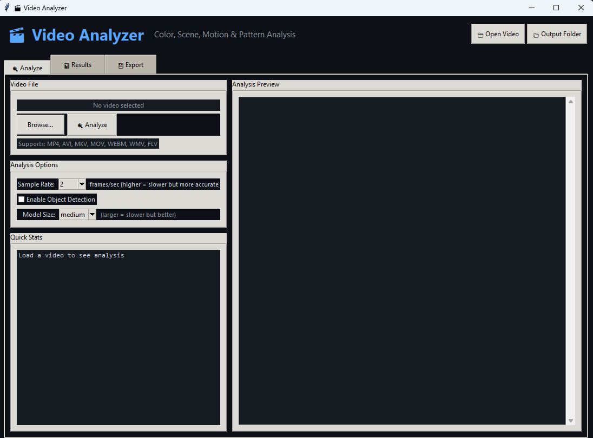

# 🎬 Video Analyzer

A desktop application for deep visual analysis of video files. Given any supported video, it extracts and visualizes data across five analytical dimensions — color, scene structure, motion, brightness, and visual rhythm — and presents the results through an interactive dark-themed GUI with exportable charts.

---

## Features

- **Color Analysis** — Extracts dominant colors and a curated palette using K-means clustering. Classifies color temperature (warm / cool / neutral) and mood (bright / dark / vibrant / muted). Tracks color transitions frame-by-frame over the full video timeline.
- **Scene Detection** — Identifies shot boundaries using frame-difference thresholds. Classifies transition types (hard cut, fade, dissolve) and computes editing pace metrics (cuts per minute, pace category).
- **Motion Analysis** — Estimates per-frame motion intensity via Farneback dense optical flow. Detects camera motion patterns and categorizes overall movement style (static → chaotic).
- **Brightness & Contrast** — Tracks mean brightness and standard-deviation contrast across all sampled frames. Classifies dark, moderate, and bright scenes by proportion.
- **Visual Rhythm & Patterns** — Computes a frame-similarity matrix, a repetition score, and a smoothed visual-rhythm signal. Identifies key frames (peak visual change moments) and estimates a visual tempo in beats per minute.
- **Object Detection (optional)** — Integrates YOLOv8 (via `ultralytics`) to detect and count objects across frames. Supports five model sizes (nano → xlarge). Tracks object colors, co-occurrences, and appearance timelines.
- **Interactive GUI** — Dark-themed Tkinter interface with three tabs: Analyze, Results, and Export. Analysis runs in a background thread so the UI stays responsive.
- **Chart Visualization** — Five dedicated Matplotlib chart views (full dashboard, color, scene, motion, object detection), all rendered in a matching dark theme.
- **Export** — One-click export of all charts as PNG, analysis data as JSON, and scene thumbnails as JPEG images.

---

## Screenshots



---

## Project Structure

The project follows a strict **one class per file** modular architecture. Every class lives in its own dedicated file inside the `SBS/` package (Scene-By-Scene), named exactly after the class it contains. The root directory holds only the entry point and launcher.

```
video-analyzer/
│
├── main.py                      # Application entry point
├── run.bat                      # Windows launcher (activates venv + runs app)
├── requirements.txt
│
└── SBS/                         # Core package — one class per file
    ├── __init__.py
    │
    ├── ColorInfo.py             # Color primitive (RGB, hex, HSV, name)
    ├── ColorAnalysis.py         # Aggregated color analysis results
    ├── Scene.py                 # Single detected scene / shot
    ├── SceneAnalysis.py         # Aggregated scene detection results
    ├── MotionAnalysis.py        # Optical-flow motion results
    ├── BrightnessAnalysis.py    # Brightness & contrast results
    ├── ObjectInfo.py            # Single YOLO detection event
    ├── ObjectAnalysis.py        # Aggregated object detection results
    ├── VisualPatternAnalysis.py # Rhythm, similarity, key-frame results
    ├── VideoAnalysis.py         # Root result object (all dimensions)
    │
    ├── VideoAnalyzer.py         # Core analysis engine
    ├── VideoAnalyzerGUI.py      # Tkinter GUI application
    ├── Visualizer.py            # All Matplotlib chart functions
    │
    ├── Style.py                 # GUI color constants (dark theme)
    └── VisualizerStyle.py       # Chart color constants (dark theme)
```

---

## Setup & Execution

### Prerequisites

- Python 3.9 or newer
- A supported video file: `.mp4`, `.avi`, `.mkv`, `.mov`, `.webm`, `.wmv`, `.flv`, `.m4v`

### 1. Clone the repository

```bash
git clone https://github.com/your-username/video-analyzer.git
cd video-analyzer
```

### 2. Create and activate a virtual environment

**Windows (cmd):**
```cmd
python -m venv .venv
.venv\Scripts\activate.bat
```

**Windows (PowerShell — run once to allow scripts):**
```powershell
Set-ExecutionPolicy -ExecutionPolicy RemoteSigned -Scope CurrentUser
.venv\Scripts\Activate.ps1
```

**macOS / Linux:**
```bash
python3 -m venv .venv
source .venv/bin/activate
```

### 3. Install dependencies

```bash
pip install -r requirements.txt
```

Core dependencies:

| Package | Purpose |
|---|---|
| `opencv-python` | Frame extraction, optical flow, histogram comparison |
| `numpy` | Array operations throughout the analysis pipeline |
| `matplotlib` | All chart rendering |
| `scikit-learn` | K-means clustering for color extraction |

**Optional — object detection:**
```bash
pip install ultralytics
```
Enables the YOLOv8-powered object detection pass. Model weights are downloaded automatically on first use.

### 4. Run the application

**Double-click** `run.bat` (Windows, recommended), or from the terminal:

```bash
python main.py
```

---

## Usage

1. Click **Browse…** or **📁 Open Video** and select a video file.
2. Choose a sample rate (frames per second to analyze — higher is slower but more accurate).
3. Optionally enable **Object Detection** and select a model size.
4. Click **🔍 Analyze** and wait for the analysis to complete.
5. Review the text summary in the **Results** tab and open individual charts with the buttons below.
6. Use the **Export** tab to save charts as PNG, the full analysis as JSON, or extract scene thumbnails.

---

## Development Note

This project was developed, polished, and refactored with the assistance of Artificial Intelligence.
